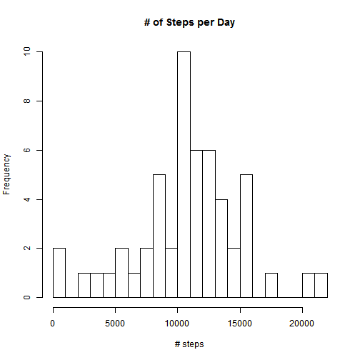
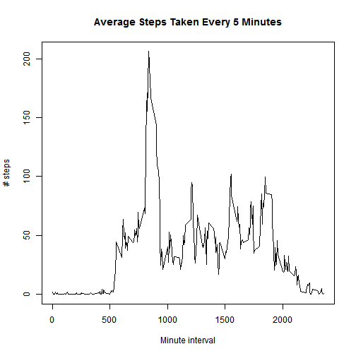
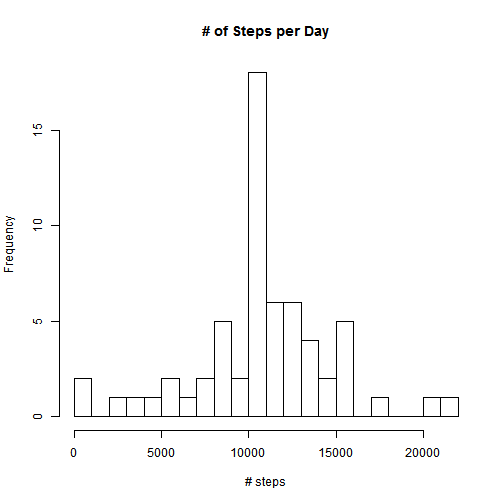
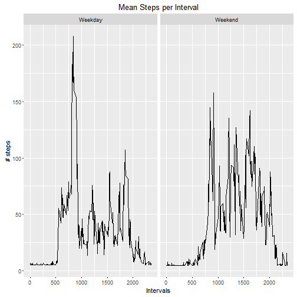

## Loading and preprocessing the data

```r
unzip("activity.zip")
act <- read.csv("activity.csv")
```

## What is mean total number of steps taken per day?

```r
## Calculate the total number of steps taken per day
stepsSum <- aggregate(steps ~ date, act, sum)

## Make a histogram of the total number of steps taken each day
hist(stepsSum$steps, breaks = 20, xlab = "# steps", main = "# of Steps per Day")
```



```r
## Calculate and report the mean and median of the total number of steps taken per day
mean(stepsSum$steps)
```

```
## [1] 10766.19
```

```r
median(stepsSum$steps)
```

```
## [1] 10765
```

## What is the average daily activity pattern?

```r
## Time-series plot
stepsMean <- aggregate(steps ~ interval, act, mean)
plot(x = stepsMean$interval, y = stepsMean$steps, type = "l", xlab = "Minute interval", ylab = "# steps", main = "Average Steps Taken Every 5 Minutes")
```



```r
## Which 5-min interval contains maximum number of steps?
stepsMean$interval[which.max(stepsMean$steps)]
```

```
## [1] 835
```

## Imputing missing values

```r
## Total number of NA values
sum(is.na(act$steps))
```

```
## [1] 2304
```

```r
## Devise a strategy for imputing missing data
stepsDay <- aggregate(steps ~ date, act, mean)  # Calculating mean steps on each day

## Fill in missing values
install.packages("Hmisc")
```

```
## Installing package into 'C:/Users/ycheong/R/win-library/3.3'
## (as 'lib' is unspecified)
```

```
## package 'Hmisc' successfully unpacked and MD5 sums checked
## 
## The downloaded binary packages are in
## 	C:\Users\ycheong\AppData\Local\Temp\RtmpuUtNgl\downloaded_packages
```

```r
library(Hmisc)
```

```
## Warning: package 'Hmisc' was built under R version 3.3.1
```

```
## Loading required package: lattice
```

```
## Loading required package: survival
```

```
## Loading required package: Formula
```

```
## Loading required package: ggplot2
```

```
## Warning: package 'ggplot2' was built under R version 3.3.1
```

```
## 
## Attaching package: 'Hmisc'
```

```
## The following objects are masked from 'package:base':
## 
##     format.pval, round.POSIXt, trunc.POSIXt, units
```

```r
actImputed <- act
actImputed$steps <- impute(actImputed$steps, mean(stepsDay$steps))  # Impute missing steps with overall mean of steps taken

## Make a histogram of the total number of steps taken each day 
stepsDay <- aggregate(steps ~ date, actImputed, sum)
hist(stepsDay$steps, breaks = 20, xlab = "# steps", main = "# of Steps per Day")
```



```r
## Calculate and report the mean and median total number of steps taken per day\
mean(stepsDay$steps)
```

```
## [1] 10766.19
```

```r
median(stepsDay$steps)
```

```
## [1] 10766.19
```

## Are there differences in activity patterns between weekdays and weekends?

```r
## Create a new factor variable in the dataset with two levels - "weekday" and "weekend"
actImputed$DayofWeek <- weekdays(as.Date(actImputed$date))
actImputed$DayofWeek <- ifelse(actImputed$DayofWeek == "Saturday" | actImputed$DayofWeek == "Sunday", "Weekend", "Weekday")
actImputed$DayofWeek <- as.factor(actImputed$DayofWeek)

## Panel plot
stepsDayofWeek <- aggregate(steps ~ interval * DayofWeek, actImputed, mean)
install.packages("ggplot2")
```

```
## Error in install.packages : Updating loaded packages
```

```r
library(ggplot2)
ppanel <- ggplot(stepsDayofWeek, aes(interval, steps)) + geom_line()
ppanel + facet_grid(. ~ DayofWeek) +
  xlab("Intervals") + ylab("# steps") + ggtitle("Mean Steps per Interval")
```



## The end


